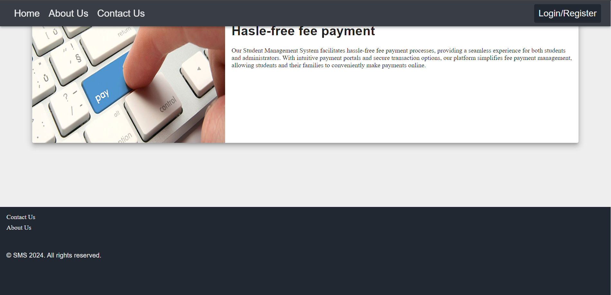

# Edu Track - The tracking agent

This is my final project developed in the journey of CDAC which shows all the skills gained in this training.

## What is _Edu Track_ all about :question:

"Edu Track" is basically student management system **_developed for students by students_** that helps them to see their attendance, grades, schedules, fee payment receipts and many more with just a click! This is also made for staff who can manage student's and educational body's data without any hasle so that all data present is up-to-date.

## Is it really needed :expressionless:

**YES**, as it helps students to concentrate on studies and achieve academic goals.Today, most of the things are getting digitalized, so why "education" not? To bring this change, first we have make most of the processes inside educational body digital like taking attendance, storing grades of students, important upcoming events, schedules for lectures, etc.After doing it there must be some application which is capable of handling those things with accuracy and efficiently.Last but not not least, operating cost of all this must be as minimal as possible because after some years, data will be doubled then tripled and so on which will lead to increasing cost of operation. That's why we need good "student management system".

## My work :test_tube:

So, I developed that student management system in consideration of all the aspects.\

- Basically 3 roles exists for this system -Student, Staff and Admin
- Except student all other can register themselves and student can be added by other two.
- Students:
  - They cannot register
  - After login, they will see dashboard which contains following sections
    - Announcements: Contains announcemnets made by educational body
    - Attendance: Attendance for logged in student
    - Schedule: Schedules of lectures
    - Grades: Marks obtained in exams and internals
    - Fees(Paid Receipts + Pending): Paid receipts contains payment history and pending contains fees which are needed to be paid
  - No information except personal info can be modified by student
- Staff and Admin:
  - They can register themselves and login to system
  - After login, all the sections are same as that of student's dashboard, only difference is that the data can be modified also.
  - There is one more section named "students" that gives list of students and new student can be regiestered into system.\
That was about what actually the flow is.

## Technologies and tools used :hammer_and_wrench:

- Languages: Java, Javascript
- Frontend: Reactjs, Material UI, Redux, HTML/CSS, React Router
- Backend: Spring Boot, Spring Data JPA, Lombok
- Database: MySQL
- API: REST architectural pattern

## Output :baby:

### Desktop

\
\
\

\
\
\

### Mobile

\
\
\

\

## Future scope :star:

:white_check_mark: "Performance report in PDF format" feature for students can be developed\
:white_check_mark: Whole classroom data can be statistically analysed to extract useful information\
:white_check_mark: Performance imporovements can be made\
:white_check_mark: One more role "faculty" can also be added\
:white_check_mark: Payment gateway for payement of fees can be added\
And the list goes on...

# Wrapping up :scroll:

A huge thanks to you for coming here and reading this readme.Have a nice day! :orange_heart: :smiley:
